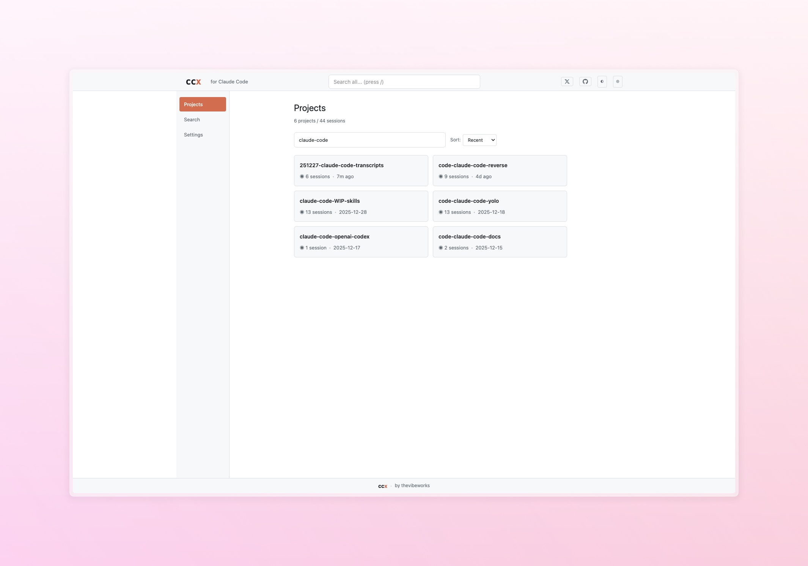
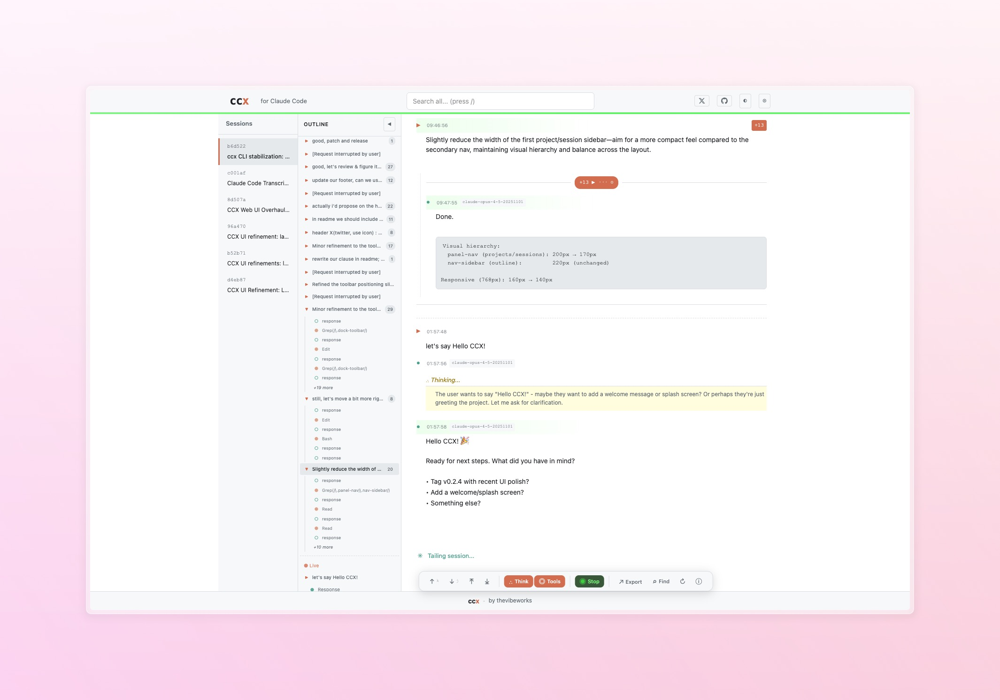
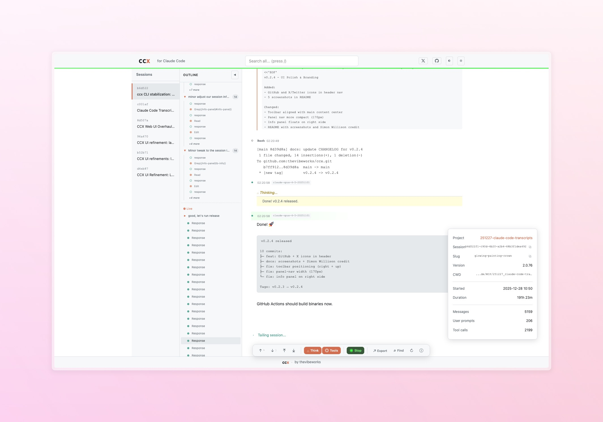
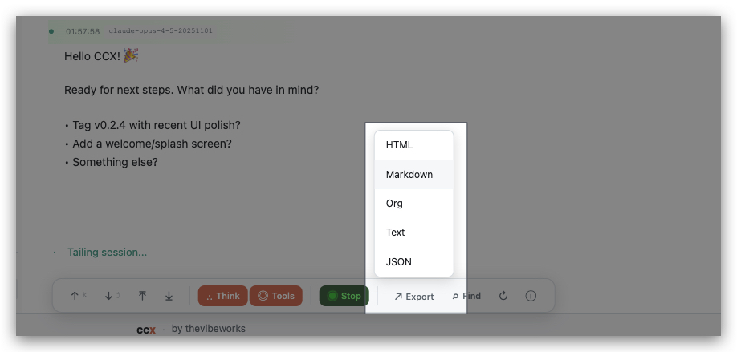
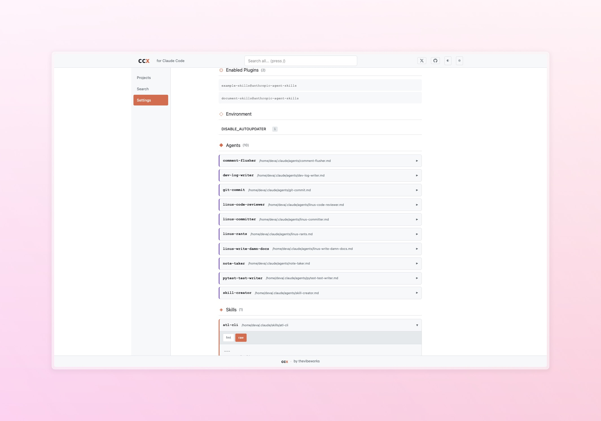

# ccx

**Session viewer for Claude Code** - Browse, search, and export your conversations.

Inspired by [Simon Willison's claude-code-transcripts](https://github.com/simonw/claude-code-transcripts) ([announcement](https://x.com/simonw/status/1872004339799512305)) - rebuilt in Go with live tailing, web UI, and two-panel navigation.

```
ccx web
```

That's it. Opens a browser at `localhost:8080`.

## Screenshots





<details>
<summary>More screenshots</summary>







</details>

## Features

- **Two-panel navigation** - Projects → Sessions → Conversation
- **Live tail mode** - Watch active sessions in real-time
- **In-session search** - Filter by User, Response, Tools, Agents, Thinking
- **Tree-aware threading** - parentUuid, sidechains, compaction markers
- **Collapsible blocks** - Thinking, tool calls, agent responses
- **Export** - HTML, Markdown, Org-mode, JSON
- **Keyboard shortcuts** - `j/k` scroll, `/` search, `z` fold, `r` refresh, `d` theme

## Installation

Requires Go 1.24+ (pure Go, no C compiler needed).

```bash
go install github.com/thevibeworks/ccx/cmd/ccx@latest
```

Or build from source:
```bash
git clone https://github.com/thevibeworks/ccx
cd ccx && make build
./bin/ccx web
```

## CLI Commands

```bash
ccx web                   # Start web UI (recommended)
ccx projects              # List all projects
ccx sessions [project]    # List sessions
ccx view [session]        # View in terminal
ccx export -f html        # Export to HTML/Markdown/Org
ccx search QUERY          # Search projects and sessions
ccx doctor                # Check configuration
```

## Configuration

ccx reads from `~/.claude/` (or `CLAUDE_CODE_HOME`) and never modifies those files.

```bash
# Override Claude Code home
ccx --claude-home /path/to/claude web
CLAUDE_CODE_HOME=/path/to/claude ccx web

# Config locations
~/.config/ccx/config.yaml     # User config
~/.local/share/ccx/           # ccx data (stars, cache)
```

## Data Safety

ccx treats Claude Code data as **read-only**. It only writes to its own directories:
- `$XDG_CONFIG_HOME/ccx/` - configuration
- `$XDG_DATA_HOME/ccx/` - SQLite data (stars, if using web UI)
- Export files you explicitly request

## License

Apache 2.0

---

Built by [thevibeworks](https://github.com/thevibeworks) · [@ericwang42](https://x.com/ericwang42)
