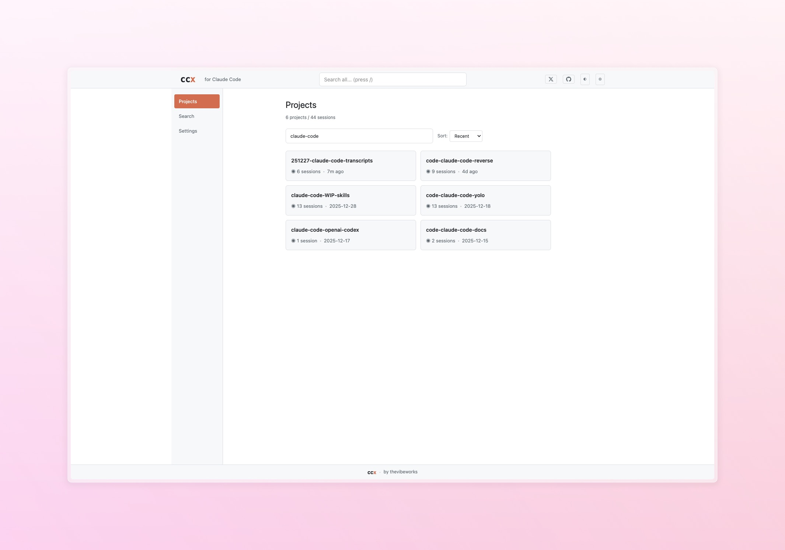
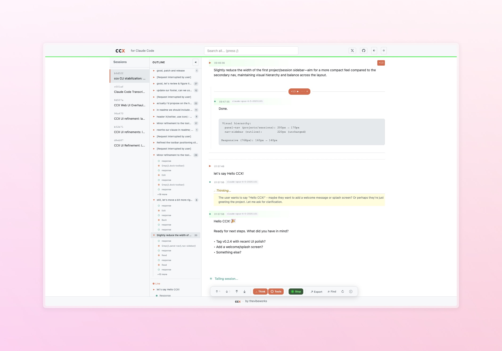
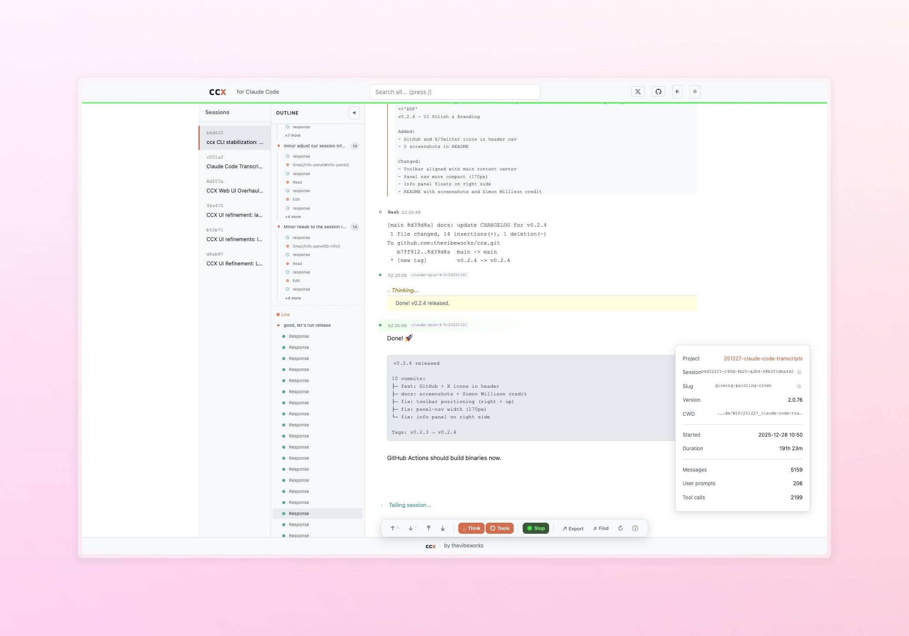
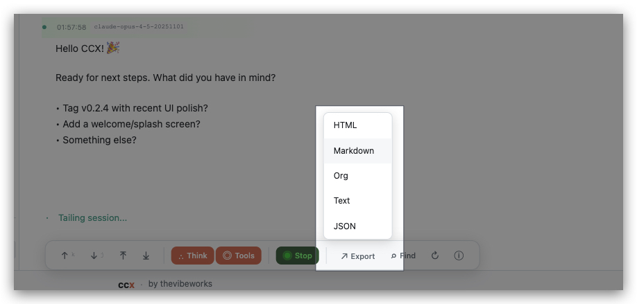
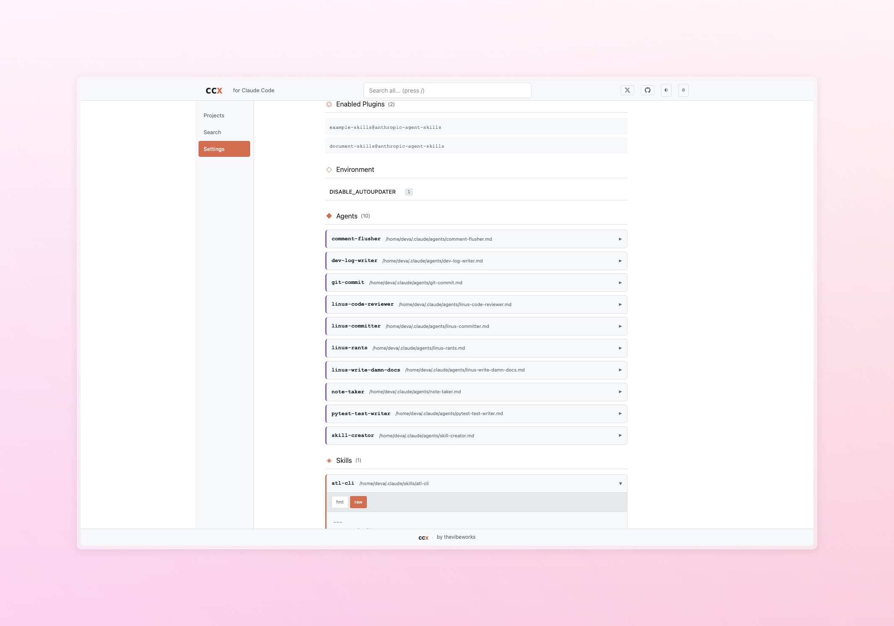

# ccx

**Session viewer for coding agents** — Browse, search, and export conversations from Claude Code and Codex.

```
ccx web
```

Opens a browser at `localhost:8080`. That's it.

## Screenshots





<details>
<summary>More screenshots</summary>







</details>

## What it does

ccx reads session files from `~/.claude/` and `~/.codex/` and gives you a fast, keyboard-driven interface to browse them.

- **Multi-provider** — Claude Code + Codex sessions merged by project, with provider badges
- **Two-panel navigation** — Projects → Sessions → Conversation tree
- **Live tail** — Watch active sessions update in real-time
- **In-session search** — Filter by User, Response, Tools, Agents, Thinking
- **Memory inspector** — View CLAUDE.md, MEMORY.md, AGENTS.md per project
- **Brief export** — Conversation-only mode strips tool noise
- **Export** — HTML, Markdown, Org-mode, JSON
- **Context trace** — `ccx trace` emits evidence for Context Folding
- **Provider filter** — `--provider cc` or `--provider cx` on any command
- **Date filter** — `--after 2026-03-01 --before 2026-04-01`
- **Keyboard shortcuts** — `j/k` scroll, `/` search, `z` fold, `r` refresh, `d` theme

Single binary, zero dependencies, read-only. Never touches your session files.

## Install

```bash
curl -fsSL https://raw.githubusercontent.com/thevibeworks/ccx/main/install.sh | bash
```

Or via Go:
```bash
go install github.com/thevibeworks/ccx/cmd/ccx@latest
```

Or build from source:
```bash
git clone https://github.com/thevibeworks/ccx
cd ccx && make build
./bin/ccx web
```

## Usage

```bash
ccx web                          # Start web UI (recommended)
ccx projects                     # List all projects
ccx sessions                     # List recent sessions for this workspace
ccx sessions --all               # List recent sessions across all projects
ccx sessions --provider=cx       # Codex sessions in this workspace
ccx sessions --after=2026-03-01  # Date filtered
ccx view [session]               # View in terminal
ccx export -f html --brief       # Export conversation-only HTML
ccx trace [session] -o trace.json # Extract evidence for context folding
ccx search "auth bug"            # Search across sessions + memory
ccx fork abc123                  # Fork session to current project
ccx doctor                       # Check setup
```

## Configuration

```yaml
# ~/.config/ccx/config.yaml
theme: dark
show_thinking: collapsed
default_format: html
providers:
  claude-code:
    enabled: true
  codex:
    enabled: true
```

Override provider homes:
```bash
ccx --claude-home /path web
ccx --codex-home /path web
```

## Data safety

ccx treats all agent data as **read-only**. Writes only to its own directories:
- `$XDG_CONFIG_HOME/ccx/` — config
- `$XDG_DATA_HOME/ccx/` — stars database

## Claude Code skills

ccx ships with Claude Code skills:

- **ccx** — Session viewer. Browse, search, export sessions from inside Claude Code.
- **ccx-context-fold** — Context Folding. Uses `ccx trace` to turn session evidence into auditable decisions (`fold.html`) and durable project knowledge (`.ccx/knowledge/`).

`ccx trace --html` produces trace evidence HTML. It is not the interpreted
`fold.html` decision trail produced by the skill.

Install alongside the binary:
```bash
curl -fsSL https://raw.githubusercontent.com/thevibeworks/ccx/main/install.sh | bash
```

Or manually copy skills to `~/.claude/skills/`:
```bash
cp -r skills/ccx/ ~/.claude/skills/ccx/
cp -r skills/ccx-context-fold/ ~/.claude/skills/ccx-context-fold/
```

Usage:
```bash
/ccx-context-fold                    # Fold most recent session
/ccx-context-fold <session-id>       # Fold specific session
/ccx-context-fold --dry-run          # Preview without writing
```

## Credits

Inspired by [Simon Willison's claude-code-transcripts](https://github.com/simonw/claude-code-transcripts). Rebuilt in Go with live tailing, multi-provider support, and a web UI.

## License

Apache 2.0

---

Built by [thevibeworks](https://github.com/thevibeworks) · [@ericwang42](https://x.com/ericwang42)
